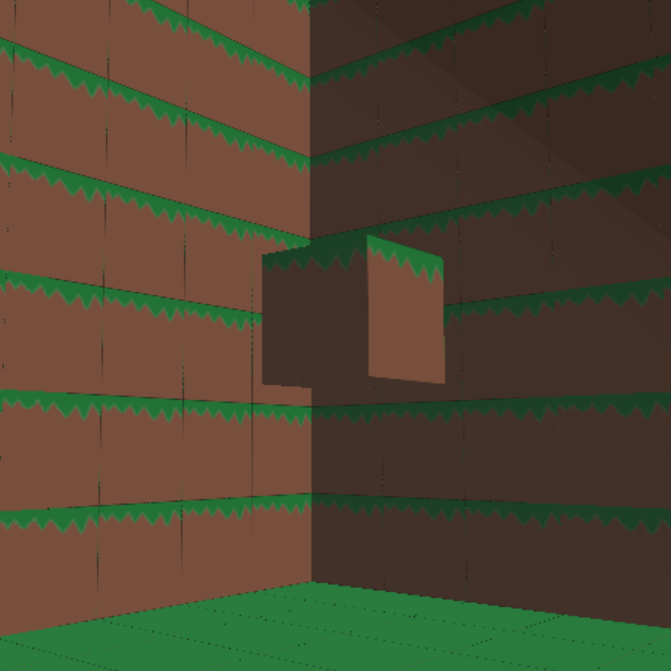
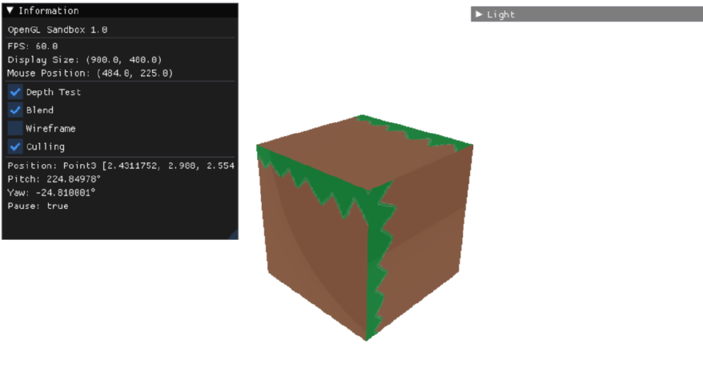
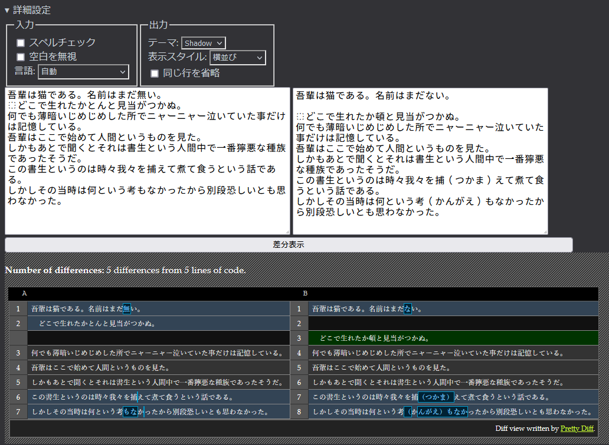
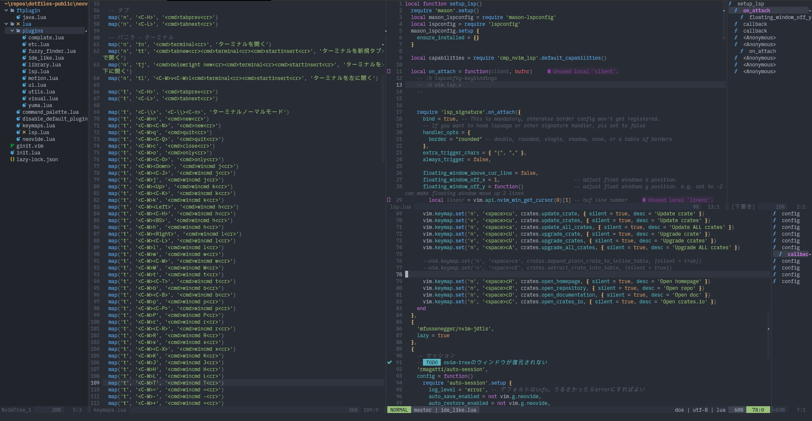
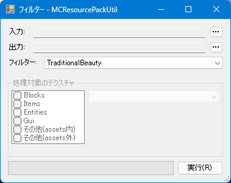
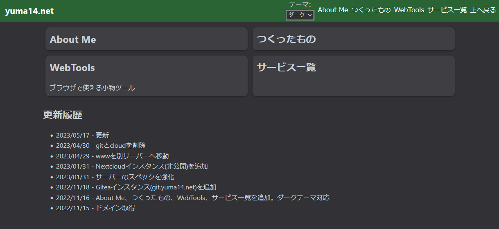
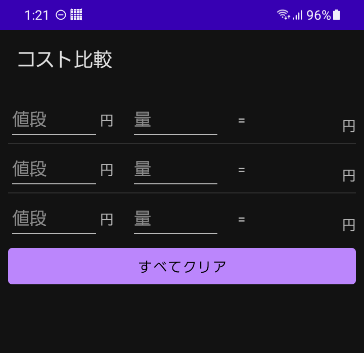

<a class="card" href="/profile">
<h2>About Me</h2>

</a>

<a class="card" href="/works">
<h2>つくったもの</h2>

</a>

<a class="card" href="/webtools">
<h2>WebTools</h2>

ブラウザで使える小物ツール

</a>

<a class="card" href="/services">
<h2>サービス一覧</h2>
</a>

## 更新履歴

- 2023/07/12 - 画像追加
- 2023/05/17 - 更新
- 2023/04/30 - gitとcloudを削除
- 2023/04/29 - wwwを別サーバーへ移動
- 2023/01/31 - Nextcloudインスタンス(非公開)を追加
- 2023/01/31 - サーバーのスペックを強化
- 2022/11/18 - Giteaインスタンス(git.yuma14.net)を追加
- 2022/11/16 - About Me、つくったもの、WebTools、サービス一覧を追加。ダークテーマ対応
- 2022/11/15 - ドメイン取得

